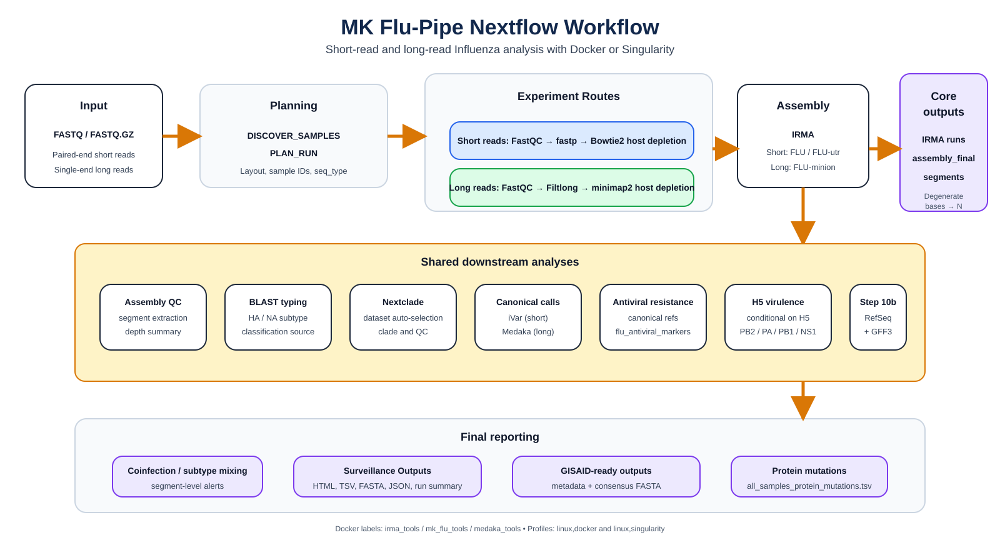

<div align="center">
  

# MK Flu-Pipe Nextflow

**A reproducible Nextflow DSL2 workflow for Influenza genomic surveillance from short-read and long-read data**

[](https://www.nextflow.io/)
[](https://www.docker.com/)
[](https://sylabs.io/docs/)
[](https://hub.docker.com/r/cdcgov/irma)
[](https://doi.org/10.5281/zenodo.20100567)

</div>

---

## Contents

- [Overview](#overview)
- [Workflow Summary](#workflow-summary)
- [Requirements](#requirements)
- [Installation](#installation)
- [Containers](#containers)
- [Running The Pipeline](#running-the-pipeline)
- [Input Files](#input-files)
- [Sample Metadata](#sample-metadata)
- [Optional HA/NA Phylogeny](#optional-hana-phylogeny)
- [Parameters](#parameters)
- [Outputs](#outputs)
- [Databases And Cache](#databases-and-cache)
- [Automated Tests](#automated-tests)
- [FAQ](#faq)
- [Citation](#citation)

## Overview

`MK Flu-Pipe Nextflow` is a containerized workflow for Influenza genomic surveillance. It supports Illumina short reads and Oxford Nanopore long reads and produces consensus FASTA files, assembly QC, typing and subtyping, Nextclade clades, antiviral resistance summaries, H5 virulence markers, protein mutation tables, GISAID-ready files, optional HA/NA phylogenies, and an interactive HTML dashboard.

The workflow is designed for local Linux/Ubuntu/WSL execution with Docker or Singularity/Apptainer. It can run complete analyses while keeping CPU, memory, and process concurrency configurable through Nextflow parameters.

## Workflow Summary

### Short-read branch

1. Discover FASTQ files and build a run plan.
2. Run raw-read QC with `FastQC`.
3. Trim and filter reads with `fastp`.
4. Optionally deplete host reads with `Bowtie2`.
5. Assemble Influenza consensus sequences with `IRMA` using `FLU` or `FLU-utr`.
6. Extract HA, NA, and other segment FASTA files.
7. Run assembly QC and coverage summaries.
8. Type and subtype samples with `BLAST`.
9. Run clade assignment with `Nextclade`.
10. Optionally call canonical variants with `iVar`.
11. Screen antiviral resistance markers.
12. Screen H5 virulence markers when relevant.
13. Optionally run full protein mutation calling.
14. Detect coinfection or subtype-mixing signals.
15. Optionally build HA/NA phylogenies with `Augur`.
16. Generate surveillance outputs and the HTML dashboard.

### Long-read branch

1. Discover FASTQ files and build a run plan.
2. Run raw-read QC with `FastQC`.
3. Filter long reads with `Filtlong`.
4. Optionally deplete host reads with `minimap2`.
5. Assemble Influenza consensus sequences with `IRMA` using `FLU-minion`.
6. Extract HA, NA, and other segment FASTA files.
7. Run assembly QC and coverage summaries.
8. Type and subtype samples with `BLAST`.
9. Run clade assignment with `Nextclade`.
10. Optionally call canonical variants with `Medaka`.
11. Screen antiviral resistance markers.
12. Screen H5 virulence markers when relevant.
13. Optionally run full protein mutation calling.
14. Detect coinfection or subtype-mixing signals.
15. Optionally build HA/NA phylogenies with `Augur`.
16. Generate surveillance outputs and the HTML dashboard.

## Requirements

Recommended system:

- Linux, Ubuntu, or WSL2.
- Nextflow `>=23.10.0`.
- Docker or Singularity/Apptainer.
- Internet access for the first database/container setup.
- At least 8 GB RAM for small tests.
- 16-32 GB RAM recommended for larger batches.
- Enough disk space for `work/`, `mk_flupipe_db/`, intermediate FASTQ files, and final outputs.

## Installation

```bash
git clone https://github.com/nascimento-jean/MK-FluPipe_NF.git
cd MK-FluPipe_NF
nextflow -version
```

The repository contains workflow code, modules, helper scripts, documentation, tests, and container recipes. It does not store prebuilt `.sif` files, downloaded databases, Nextflow `work/`, or analysis outputs.

## Containers

The workflow uses three container groups:

| Container group | Purpose |
|---|---|
| `irma_tools` | IRMA assembly through `cdcgov/irma:v1.3.2`. |
| `mk_flu_tools` | Main workflow tools including FastQC, fastp, Filtlong, BLAST, Nextclade, Augur, IQ-TREE, and helper scripts. |
| `medaka_tools` | Medaka-related tools for long-read variant analysis. |

Build Docker images:

```bash
bash containers/build_docker_images.sh
```

Build Singularity/Apptainer images:

```bash
bash containers/build_singularity_images.sh
```

Public container images can also be used from GitHub Container Registry (GHCR) after they are published by the repository workflow:

| Image | GHCR path |
|---|---|
| Main workflow tools | `ghcr.io/nascimento-jean/mk-flupipe-nf-mk-flu-tools:<tag>` |
| Medaka tools | `ghcr.io/nascimento-jean/mk-flupipe-nf-medaka-tools:<tag>` |

Use the extra `ghcr` profile to replace local images with GHCR images:

```bash
-profile linux,docker,ghcr
```

or:

```bash
-profile linux,singularity,ghcr
```

By default, the `ghcr` profile uses `--container_tag latest`. For reproducible runs, prefer a release tag:

```bash
--container_tag v0.1.2
```

## Running The Pipeline

Use the `linux` profile together with either `docker` or `singularity`.

```bash
-profile linux,docker
```

or:

```bash
-profile linux,singularity
```

To use published GHCR images instead of locally built images, add the `ghcr` profile:

```bash
-profile linux,docker,ghcr
```

or:

```bash
-profile linux,singularity,ghcr
```

The `wsl` and `ubuntu` profiles are retained as compatibility aliases, but `linux` is the recommended profile.

### Minimal short-read example

```bash
nextflow run main.nf \
  -resume \
  -profile linux,docker \
  --input_dir /path/to/FLU/ \
  --output_dir mk-flupipe_short_results \
  --irma_module FLU-utr \
  --seq_type short \
  --host_depletion true \
  --run_ivar true \
  --run_antiviral true \
  --run_h5_virulence true \
  --run_fullvarcall true
```

### Minimal long-read example

```bash
nextflow run main.nf \
  -resume \
  -profile linux,singularity \
  --input_dir /path/to/FLU_long/ \
  --output_dir mk-flupipe_long_results \
  --irma_module FLU-minion \
  --seq_type long \
  --host_depletion true \
  --run_medaka true \
  --run_antiviral true \
  --run_h5_virulence true \
  --run_fullvarcall true
```

### Full short-read example with QC, GISAID, metadata, phylogeny, and resources

```bash
nextflow run main.nf \
  -resume \
  -profile linux,docker \
  --input_dir /path/to/FLU/ \
  --output_dir mk-flupipe_results \
  --irma_module FLU-utr \
  --seq_type auto \
  --host_depletion true \
  --adapter_fasta /path/to/adapters.fa \
  --min_len_short 75 \
  --min_qual 20 \
  --min_coverage 50 \
  --max_n_pct 10 \
  --min_segments 4 \
  --ivar_freq 0.03 \
  --ivar_depth 10 \
  --minority_freq 0.20 \
  --coinfection_pct 5.0 \
  --gisaid_location Brazil-AL \
  --gisaid_year 2026 \
  --metadata_csv /path/to/sample_metadata.csv \
  --run_phylogeny true \
  --phylogeny_context_fasta /path/to/context_ha_na.fasta \
  --phylogeny_context_metadata /path/to/context_ha_na.csv \
  --phylogeny_min_sequences 3 \
  --phylogeny_threads 4 \
  --max_cpus 8 \
  --max_memory "24 GB" \
  --queue_size 2 \
  --run_ivar true \
  --run_fullvarcall true
```

### Full long-read example with metadata and phylogeny

```bash
nextflow run main.nf \
  -resume \
  -profile linux,singularity \
  --input_dir /path/to/FLU_long/ \
  --output_dir mk-flupipe_long_results \
  --irma_module FLU-minion \
  --seq_type long \
  --host_depletion true \
  --min_len_long 200 \
  --max_len_long 0 \
  --filtlong_min_mean_q 10 \
  --run_medaka true \
  --run_antiviral true \
  --run_h5_virulence true \
  --run_fullvarcall true \
  --metadata_csv /path/to/sample_metadata.csv \
  --run_phylogeny true \
  --phylogeny_context_fasta /path/to/context_ha_na.fasta \
  --phylogeny_context_metadata /path/to/context_ha_na.csv \
  --max_cpus 8 \
  --max_memory "24 GB" \
  --queue_size 2
```

All parameters have defaults in `nextflow.config`. If a parameter is omitted, the workflow uses the configured default value.

## Input Files

The pipeline expects FASTQ or FASTQ.GZ files in `--input_dir`.

For common Illumina names such as:

```text
261118000051_S40_L001_R1_001.fastq.gz
261118000051_S40_L001_R2_001.fastq.gz
```

the reported sample ID is:

```text
261118000051
```

The technical Illumina `_S<number>` token is removed so metadata can use biological/sample identifiers rather than sequencing-lane identifiers.

## Sample Metadata

`--metadata_csv` is optional for the dashboard metadata tab, but required when `--run_phylogeny true`.

Required columns:

| Column | Description |
|---|---|
| `sample_name` | Sample identifier after pipeline discovery. It must match the sample IDs detected from FASTQ names. |
| `collection_date` | Sampling date in ISO format: `YYYY-MM-DD`. |

Optional columns:

| Column | Description |
|---|---|
| `country` | Country used in reporting and phylogeny metadata. |
| `state` | State, province, department, region, or other subnational locality. Used to color context sequences in Auspice trees. |
| `city` | City or municipality. |
| `location` | Optional combined location field retained for compatibility. |

Example:

```csv
sample_name,collection_date,country,state,city
261118000051,2026-02-20,Brazil,Alagoas,Maceio
261118000052,2026-02-23,Brazil,Alagoas,Maceio
```

When metadata is supplied, the workflow validates that every discovered sample appears exactly once. The validated table is exported to `Surveillance_Outputs/metadata.csv` and displayed in the dashboard.

## Optional HA/NA Phylogeny

The optional phylogeny module builds trees for HA and NA only. These segments are the most useful for Influenza subtype-specific surveillance and contextual comparison.

Tree grouping:

| Virus group | Tree grouping behavior |
|---|---|
| Influenza A | Separate trees by subtype and segment, such as `A_H1_HA`, `A_H3_HA`, `A_H5_HA`, `A_N1_NA`, `A_N2_NA`, or `A_N3_NA`. |
| Influenza B | Separate trees by segment only: `B_HA` and `B_NA`. |

The module uses the consensus segment FASTA files produced by the pipeline, so the same implementation works for short-read and long-read runs.

Required for phylogeny:

- `--run_phylogeny true`
- `--metadata_csv`
- valid HA/NA segment FASTA files generated by the pipeline

Optional context files:

- `--phylogeny_context_fasta`
- `--phylogeny_context_metadata`

Context metadata must match the context FASTA identifiers.

Required context metadata columns:

| Column | Description |
|---|---|
| `strain` | FASTA record identifier for the context sequence. |
| `collection_date` | Sampling date in ISO format: `YYYY-MM-DD`. |
| `type` | Influenza type: `A` or `B`. |
| `segment` | `HA` or `NA`. |

Required for Influenza A context records:

| Column | Description |
|---|---|
| `subtype_HA` | HA subtype for HA records, such as `H1`, `H3`, or `H5`. |
| `subtype_NA` | NA subtype for NA records, such as `N1`, `N2`, or `N3`. |

Optional context metadata columns:

| Column | Description |
|---|---|
| `country` | Country for context sequence metadata. |
| `state` | Locality used to color context tips in Auspice. This can be any user-provided subnational or regional value, not only Brazilian states. |
| `city` | City or municipality. |
| `source` | Source label such as `NCBI`, `GISAID`, or `LocalContext`. |

Example context metadata:

```csv
strain,collection_date,type,segment,subtype_HA,subtype_NA,country,state,city,source
NCBI_H3_HA_001,2025-10-15,A,HA,H3,N2,Brazil,Alagoas,Maceio,NCBI
GISAID_H3_NA_001,2025-10-15,A,NA,H3,N2,Brazil,Sao Paulo,Sao Paulo,GISAID
GISAID_B_HA_001,2025-11-03,B,HA,-,-,Argentina,Buenos Aires,Buenos Aires,GISAID
```

Coloring in Auspice:

- pipeline-generated sequences are labeled `User Sequences` and colored dark red (`#8B0000`);
- context sequences are colored dynamically by the `state` column from the context metadata;
- missing context locality values are shown as `State not available`;
- the time-scaled tree uses `collection_date`; coloring does not replace temporal dating.

For each generated tree, MK Flu-Pipe also writes an offline `HTML` viewer next to the Augur outputs. This static viewer uses the same state/source colors and can be opened directly from the dashboard without requiring internet access. The Auspice JSON remains available for fully interactive visualization in a Nextstrain/Auspice viewer.

GISAID sequences are not downloaded automatically. If GISAID context is used, authorized users must download the sequences and metadata themselves and analyze them locally according to GISAID terms. NCBI or other public context datasets can be supplied through the same FASTA/metadata interface.

## Parameters

### Core run parameters

| Parameter | Default | Description |
|---|---:|---|
| `--input_dir` | `null` | Directory with FASTQ or FASTQ.GZ input files. Required. |
| `--output_dir` | `${projectDir}/results` | Output directory. |
| `--irma_module` | `null` | IRMA module. Use `FLU-utr` for short reads and `FLU-minion` for long reads. |
| `--seq_type` | `auto` | Sequencing type: `auto`, `short`, or `long`. For ONT runs, explicitly use `long`. |
| `--seq_mode` | empty | Optional discovery-mode hint retained for compatibility. Usually left empty. |

### Analysis switches

| Parameter | Default | Description |
|---|---:|---|
| `--run_fastqc` | `true` | Run raw-read FastQC. |
| `--host_depletion` | `false` | Enable host depletion. Short reads use Bowtie2; long reads use minimap2. |
| `--run_ivar` | `false` | Enable canonical short-read variant calling with iVar. |
| `--run_medaka` | `false` | Enable canonical long-read variant calling with Medaka. Required for long-read antiviral resistance analysis. |
| `--run_antiviral` | `true` | Run antiviral resistance analysis. |
| `--run_h5_virulence` | `true` | Run H5 virulence marker analysis. |
| `--run_fullvarcall` | `false` | Run full protein mutation calling. |
| `--run_phylogeny` | `false` | Run optional Augur HA/NA phylogeny. Requires `--metadata_csv`. |
| `--run_legacy_bridge` | `false` | Run the optional legacy Bash bridge after the Nextflow workflow. Normally disabled. |

### Container registry parameters

| Parameter | Default | Description |
|---|---:|---|
| `--container_registry` | `ghcr.io/nascimento-jean` | Registry namespace used by the `ghcr` profile. |
| `--container_tag` | `latest` | Image tag used by the `ghcr` profile. Use a release tag such as `v0.1.2` for reproducible runs. |

### Short-read preprocessing parameters

| Parameter | Default | Description |
|---|---:|---|
| `--adapter_fasta` | empty | Optional adapter FASTA passed to fastp. If empty, paired-end adapter detection is used. |
| `--min_len_short` | `75` | Minimum read length retained by fastp. |
| `--min_qual` | `20` | Minimum qualified base quality threshold used by fastp. |

### Long-read preprocessing parameters

| Parameter | Default | Description |
|---|---:|---|
| `--min_len_long` | `200` | Minimum long-read length retained by Filtlong. |
| `--max_len_long` | `0` | Maximum long-read length retained by Filtlong. `0` disables the upper limit. |
| `--filtlong_min_mean_q` | `null` | Optional minimum mean long-read quality for Filtlong. |

### Assembly QC, variant, and interpretation parameters

| Parameter | Default | Description |
|---|---:|---|
| `--min_coverage` | `50` | Minimum segment coverage threshold for assembly QC and reporting. |
| `--max_n_pct` | `10` | Maximum allowed percentage of `N` bases before flagging. |
| `--min_segments` | `4` | Minimum number of detected segments expected for downstream reporting. |
| `--ivar_freq` | `0.03` | Minimum allele frequency used by iVar. |
| `--ivar_depth` | `10` | Minimum depth used by iVar. |
| `--minority_freq` | `0.20` | Frequency threshold for minority variant interpretation. |
| `--coinfection_pct` | `5.0` | Percentage threshold used to flag possible coinfection or subtype mixing. |
| `--medaka_env` | `medaka_env` | Compatibility value for legacy Medaka logic. Containerized runs do not require manual activation. |

### GISAID parameters

| Parameter | Default | Description |
|---|---:|---|
| `--gisaid_location` | empty | Location string used to create GISAID-style isolate names and enable `GISAID_ready/` outputs. |
| `--gisaid_year` | `null` | Year used in GISAID-style isolate names. If omitted, the current year is used. |

### Metadata and phylogeny parameters

| Parameter | Default | Description |
|---|---:|---|
| `--metadata_csv` | empty | Optional sample metadata CSV. Required for `--run_phylogeny true`. |
| `--phylogeny_context_fasta` | empty | Optional HA/NA FASTA with context sequences from NCBI or manually downloaded GISAID data. |
| `--phylogeny_context_metadata` | empty | Metadata CSV/TSV matching the context FASTA. Must be supplied together with `--phylogeny_context_fasta`. |
| `--phylogeny_min_sequences` | `3` | Minimum total sequence count required before each independent tree is generated. |
| `--phylogeny_threads` | `4` | Maximum threads requested by Augur, MAFFT, and IQ-TREE. |

### Resource and concurrency parameters

| Parameter | Default | Description |
|---|---:|---|
| `--max_cpus` | `null` | Global CPU cap per process. |
| `--max_memory` | `null` | Global memory cap per process, for example `"24 GB"`. |
| `--queue_size` | `8` | Local executor queue size. |
| `--fastqc_threads` | `2` | Threads requested by FastQC. |
| `--fastp_threads` | `2` | Threads requested by fastp. |
| `--host_depletion_threads` | `2` | Threads requested by host depletion processes. |
| `--irma_threads` | `4` | Threads requested by IRMA tasks. |
| `--fastp_max_forks` | `2` | Maximum concurrent fastp tasks. |
| `--fastp_timeout` | `1800` | Hard timeout in seconds for a fastp task. |
| `--fastp_startup_timeout` | `300` | Startup watchdog in seconds for fastp. |
| `--host_depletion_max_forks` | `2` | Maximum concurrent host depletion tasks. |
| `--irma_max_forks` | `2` | Maximum concurrent IRMA tasks. |

### Container and reference parameters

| Parameter | Default | Description |
|---|---:|---|
| `--mk_flu_docker_image` | `mk-flu-pipe/mk_flu_tools:local` | Docker image for the main workflow tools. |
| `--medaka_docker_image` | `mk-flu-pipe/medaka_tools:local` | Docker image for Medaka tools. |
| `--irma_docker_image` | `cdcgov/irma:v1.3.2` | Docker image for IRMA. |
| `--mk_flu_singularity_image` | `${projectDir}/containers/sif/mk_flu_tools_local.sif` | Singularity image for main workflow tools. |
| `--medaka_singularity_image` | `${projectDir}/containers/sif/medaka_tools_local.sif` | Singularity image for Medaka tools. |
| `--irma_singularity_image` | `docker://cdcgov/irma:v1.3.2` | Singularity/Apptainer IRMA image source. |
| `--singularity_cache_dir` | `${HOME}/.singularity/cache` | Singularity cache directory. |
| `--human_db_dir` | `${HOME}/mk_flupipe_db/human_genome` | Human reference/index directory. |
| `--blast_db_dir` | `${HOME}/mk_flupipe_db` | Influenza database/cache directory. |
| `--nextclade_datasets_dir` | `${params.blast_db_dir}/nextclade_datasets` | Cached Nextclade datasets. |
| `--canonical_refs_dir` | `${params.blast_db_dir}/canonical_refs` | Canonical reference directory. |
| `--refseq_segments_dir` | `${params.blast_db_dir}/refseq_segments` | RefSeq segment references and GFF3 files. |

The complete parameter contract is documented in `nextflow_schema.json`. Example parameter files are provided in `params.example.yml` and `params.long.example.yml`.

## Outputs

All outputs are written under `--output_dir`.

### Main output folders

| Path | Contents |
|---|---|
| `bootstrap/` | Discovered sample sheets, run planning files, and optional validated metadata. |
| `qc_reports/` | FastQC, fastp/Filtlong, host depletion, assembly QC, depth summaries, and MultiQC inputs/reports. |
| `preprocessed_reads/` | Reads after fastp or Filtlong. |
| `depleted_reads/` | Reads after host depletion when enabled. |
| `irma_runs_short/` | Per-sample short-read IRMA run directories. |
| `irma_runs_long/` | Per-sample long-read IRMA run directories. |
| `assembly_final/` | Final consensus FASTA files, segment FASTA files, typing, Nextclade, QC, resistance, H5, coinfection, and phylogeny inputs. |
| `depth_per_position/` | Per-sample depth tables. |
| `variant_calls/` | Canonical short-read or Medaka variant outputs. |
| `variant_calls_canonical_long/` | Long-read canonical Medaka outputs. |
| `full_variant_calls/` | Per-sample and merged full protein mutation reports. |
| `functional_annotation/` | Structured functional annotation table derived from full variant call protein mutation outputs. |
| `Surveillance_Outputs/` | Main final delivery folder for dashboard, final tables, FASTA exports, GISAID-ready files, metadata, and phylogeny outputs. |
| `legacy_bridge/` | Optional legacy bridge outputs when enabled. |

### Final surveillance outputs

| Path | Contents |
|---|---|
| `Surveillance_Outputs/surveillance_report.html` | Interactive dashboard with Overview, QC Dashboard, Typing, Resistance and H5, Coinfection, Protein Mutations, optional Metadata/Phylogeny, and Downloads tabs. |
| `Surveillance_Outputs/multiqc_report.html` | Copy of the full MultiQC report when available. |
| `Surveillance_Outputs/typing_results.tsv` | Integrated typing table combining BLAST, Nextclade, assembly QC, and hit metadata. |
| `Surveillance_Outputs/coverage_per_segment.tsv` | Per-segment coverage summary. |
| `Surveillance_Outputs/preprocessing_summary.tsv` | fastp or Filtlong summary table. |
| `Surveillance_Outputs/host_depletion_summary.tsv` | Read counts before and after host depletion. |
| `Surveillance_Outputs/run_summary.tsv` | Compact integrated per-sample run summary. |
| `Surveillance_Outputs/run_summary.json` | JSON version of the integrated run summary. |
| `Surveillance_Outputs/multisample_consensus.fasta` | Multi-sample final consensus FASTA with per-sample/per-segment identifiers. |
| `Surveillance_Outputs/functional_annotation/functional_annotation.tsv` | Structured functional annotation of protein mutation calls when `--run_fullvarcall true` is used. |
| `Surveillance_Outputs/metadata.csv` | Validated sample metadata when `--metadata_csv` is provided. |
| `Surveillance_Outputs/README_outputs.txt` | Plain-text explanation of the final delivery folder. |

### GISAID-ready outputs

Generated only when `--gisaid_location` is provided.

| Path | Contents |
|---|---|
| `Surveillance_Outputs/GISAID_ready/gisaid_sequences.fasta` | FASTA file for GISAID preparation. It uses the same segment-aware headers as `multisample_consensus.fasta`. |
| `Surveillance_Outputs/GISAID_ready/gisaid_metadata.csv` | GISAID-style metadata template with isolate names, type/subtype, clade, location, host, lab fields, collection date, and submitter fields. |

### Phylogeny outputs

Generated only when `--run_phylogeny true`.

| Path | Contents |
|---|---|
| `Surveillance_Outputs/phylogeny/phylogeny_summary.tsv` | Status table for each eligible HA/NA tree group. |
| `Surveillance_Outputs/phylogeny/<group>/sequences.fasta` | FASTA used to build that tree. |
| `Surveillance_Outputs/phylogeny/<group>/metadata.tsv` | Metadata used by Augur for that tree. |
| `Surveillance_Outputs/phylogeny/<group>/colors.tsv` | Explicit Auspice color scale. User sequences are dark red; context sequences are colored by metadata `state`. |
| `Surveillance_Outputs/phylogeny/<group>/<group>.html` | Offline static tree viewer linked from the dashboard. |
| `Surveillance_Outputs/phylogeny/<group>/<group>.json` | Auspice-compatible JSON dataset. |
| `Surveillance_Outputs/phylogeny/<group>/tree.nwk` | Refined Newick tree. |

### Variant, resistance, and mutation outputs

| Path | Contents |
|---|---|
| `assembly_final/antiviral_resistance/antiviral_resistance.tsv` | Antiviral resistance calls. |
| `assembly_final/h5_virulence/h5_virulence_markers.tsv` | H5 virulence marker results. |
| `assembly_final/coinfection/coinfection_report.tsv` | Coinfection/subtype mixing summary. |
| `full_variant_calls/*.fullvarcall` | Per-sample protein mutation reports. |
| `full_variant_calls/all_samples_protein_mutations.tsv` | Consolidated protein mutation table. |
| `functional_annotation/functional_annotation.tsv` | Per-mutation table with sample, type/subtype, segment, gene, amino-acid change, effect class, impact class, frequency, depth, and annotation source. |

## Databases And Cache

The workflow creates and updates `mk_flupipe_db/` automatically. This cache can contain:

- human reference and host-depletion indexes;
- Influenza BLAST database;
- Nextclade datasets;
- canonical references;
- RefSeq segment references and GFF3 files;
- antiviral resistance marker databases.

If `mk_flupipe_db/` is deleted, required resources are rebuilt or downloaded on the next run.

## Automated Tests

The repository includes lightweight checks for schema validation, sample discovery, metadata validation, phylogeny grouping, surveillance output rendering, and selected Nextflow parameter validation.

Run local Python smoke tests:

```bash
python3 tests/check_discover_samples.py
python3 tests/check_metadata.py
python3 tests/check_phylogeny.py
python3 tests/check_light_integration.py
python3 tests/check_surveillance_outputs.py
```

If `nf-test` is installed, run:

```bash
nf-test test tests/nf-test
```

These checks do not execute the full containerized analysis stack. They are fast guardrails for metadata, sample naming, parameter validation, and helper-script behavior.

## FAQ

### Do I need to provide every parameter?

No. Parameters are optional unless required for a specific feature. For example, `--metadata_csv` is required only when metadata validation or phylogeny is requested.

### Does the pipeline download GISAID data?

No. GISAID data must be downloaded by an authorized user and supplied locally as context FASTA and metadata.

### Can I run the same phylogeny module for short and long reads?

Yes. The phylogeny module uses the final HA/NA consensus segment FASTA files, so it is independent of the original read type.

### What happens if one IRMA sample fails?

The workflow records the failed sample in the IRMA status output and continues downstream with samples that produced usable consensus FASTA files.

### Why can `work/` become large?

Nextflow stores staged inputs, intermediate files, logs, and cached task outputs in `work/`. This is normal and enables `-resume`.

### What happens to degenerate bases?

Final consensus FASTA files and GISAID-ready FASTA exports are normalized so degenerate bases are converted to `N`.

## Citation

If you use MK Flu-Pipe Nextflow, cite the repository and the archived release DOI:

[https://doi.org/10.5281/zenodo.20100567](https://doi.org/10.5281/zenodo.20100567)
